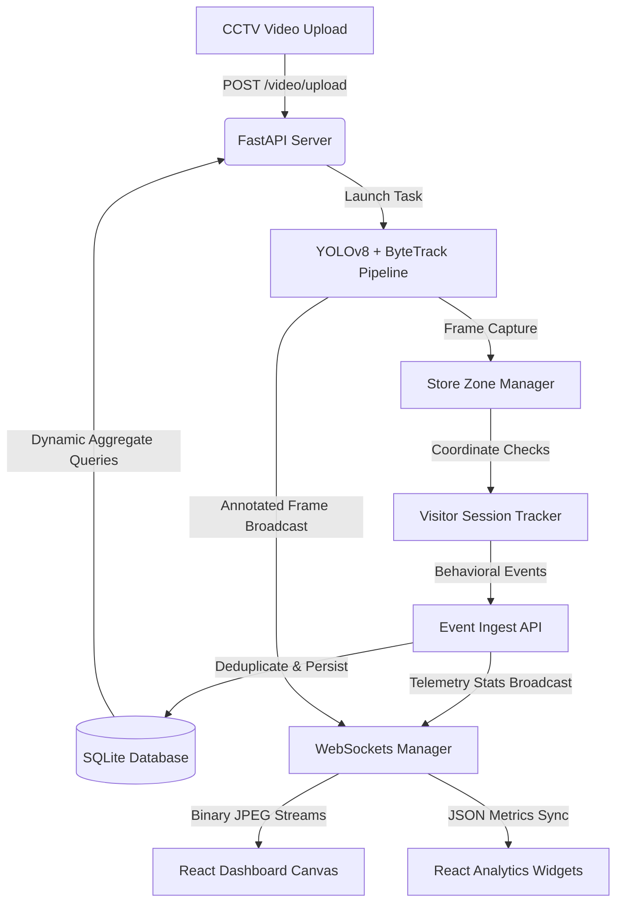

# AURA: AI Retail Intelligence Platform

AURA is a production-grade **AI-powered Retail Intelligence SaaS platform** built for high-performance offline store analytics. By parsing raw CCTV security camera feeds, AURA translates shopper movements into actionable business telemetry, structured behavioral events, conversion funnels, register queue tracking, and live operational anomaly plans.

Every time a new video is uploaded or the page is refreshed, all telemetry, events, sessions, metrics, heatmaps, funnels, and operational anomalies are automatically reset, creating a clean environment for the new store video feed.

---

## 🌐 Live Demo

| Service | URL |
|---|---|
| 🖥️ **Frontend Dashboard** | [https://purplle-hackathon-smart-cctv-api-an.vercel.app](https://purplle-hackathon-smart-cctv-api-an.vercel.app) |
| ⚙️ **Backend API** | [https://purplle-smart-cctv-api.onrender.com](https://purplle-smart-cctv-api.onrender.com) |
| 📖 **API Docs (Swagger)** | [https://purplle-smart-cctv-api.onrender.com/docs](https://purplle-smart-cctv-api.onrender.com/docs) |
| 💚 **Health Check** | [https://purplle-smart-cctv-api.onrender.com/health](https://purplle-smart-cctv-api.onrender.com/health) |

> **Note:** The backend runs on Render's free tier and may take **~50 seconds to wake up** after a period of inactivity. Wait for the WebSocket status indicator to turn **green (Synced)** before uploading a video.

---

## 📽️ System Design Topology

Below is the logical data flow representing how raw security video transforms into live analytics visualizations on the React dashboard:



---

## 🚀 Features

* **Real-time Bounding Box & HUD Overlays**: Green tracking boxes, unique visitor IDs (`VIS_001`), entry/exit lines, movement vectors, live counts, and active polygon zones.
* **Non-Blocking Inference Engine**: Leverages `asyncio.to_thread` executors for the CPU-bound YOLO tracking loop, preventing event loop starvation and ensuring zero WebSocket drops.
* **Idempotent Ingestion Pipeline**: Ingests up to 500 behavioral events per batch with unique constraint SQL deduplication.
* **Shopper Funnel Analytics**: Dynamic conversions modeled sequentially (`Entry ➔ Zone Browse ➔ Queue Join ➔ Checkout Purchase`) without double-counting.
* **Behavioral Employee Exclusion**: Shoppers staying in cash register zones or residing in frame counts exceeding thresholds are automatically tagged as staff and excluded from metrics.
* **Automatic Session Isolation / Video Reset**: All metrics, heatmaps, funnels, anomalies, and DB events reset instantly on new video uploads or page refreshes.
* **Live Operational Anomalies**: Automatic alerts for Billing Queue Bottlenecks, Conversion Drops, Stale Camera Feeds, and Dead Zones.
* **Dynamic Network Binding**: WebSockets and APIs dynamically bind to `window.location.hostname`, ensuring full out-of-the-box functionality across virtual machines, custom IPs, or domains.

---

## 📁 Folder Structure

```text
/purplle
├── backend/                  # FastAPI API Service
│   ├── app/
│   │   ├── main.py           # Routes, websockets, uploads
│   │   ├── database.py       # SQLite connection & database tables
│   │   ├── models.py         # Pydantic schemas & response validation
│   │   ├── ingestion.py      # Idempotent bulk event ingestion
│   │   ├── metrics.py        # Retail KPI computations
│   │   ├── funnel.py         # Shopper session conversions
│   │   ├── anomalies.py      # Bottleneck & dead zone engines
│   │   ├── health.py         # Diagnostic check probe
│   │   └── websocket.py      # Client WebSocket manager
│   ├── tests/                # Pytest suites
│   ├── Dockerfile
│   ├── run.py                # Server execution entry point
│   └── requirements.txt
│
├── pipeline/                 # YOLOv8 + Supervision Video Tracking Node
│   ├── detect.py             # Frame-by-frame tracker and drawing HUD
│   ├── tracker.py            # Shopper session state machine
│   ├── zones.py              # Retail polygon & line boundaries
│   └── emit.py               # REST event emitter (legacy)
│
├── frontend/                 # React + Vite SaaS Client Dashboard
│   ├── src/
│   │   ├── App.jsx           # Master dashboard panel
│   │   └── index.css         # Styling, glassmorphic themes
│   ├── postcss.config.js     
│   ├── tailwind.config.js    
│   ├── index.html            
│   └── Dockerfile
│
├── docs/                     # Comprehensive architecture documentation
│   ├── DESIGN.md             # Systems design & telemetry
│   └── CHOICES.md            # Technical options & tradeoffs
│
├── docker-compose.yml        # Multi-container orchestrator
├── requirements.txt          # Python root dependencies
└── yolov8n.pt                # Local YOLO weights (nano, offline support)
```

---

## ⚙️ How to Run & Start the Platform

### Option A: Standard Quick-Start (Docker Compose)
This is the **recommended** method. It compiles and deploys both Vite (frontend) and FastAPI (backend) in a unified multi-container stack.

1. Ensure [Docker Desktop](https://www.docker.com/products/docker-desktop/) is running.
2. In the root directory, run:
   ```bash
   docker compose up --build
   ```
3. Once initialized:
   * **Interactive Web UI**: [http://localhost:5173](http://localhost:5173)
   * **FastAPI Docs**: [http://localhost:8000/docs](http://localhost:8000/docs)
   * **API Health Status**: [http://localhost:8000/health](http://localhost:8000/health)

---

### Option B: Manual Local Startup (Without Docker)
If you prefer running services individually on your local host developer machine:

#### Prerequisites
* Node.js (v18+)
* Python (3.10+)

#### 1. Start the Backend API Server
1. Navigate to the backend directory:
   ```bash
   cd backend
   ```
2. Create and activate a Python virtual environment:
   ```bash
   python3 -m venv venv
   source venv/bin/activate
   ```
3. Install dependencies:
   ```bash
   pip install -r requirements.txt
   ```
4. Start the server (uses `run.py` to guarantee package import order):
   ```bash
   python run.py
   ```
   *The backend will boot up at `http://127.0.0.1:8000`.*

#### 2. Start the Frontend client
1. In a new terminal window, navigate to the frontend directory:
   ```bash
   cd frontend
   ```
2. Install npm packages:
   ```bash
   npm install
   ```
3. Launch the development server:
   ```bash
   npm run dev
   ```
   *The React web client will boot up at `http://localhost:5173`.*

---

## 📽️ Using the Dashboard

1. Open the dashboard in your browser (`http://localhost:5173`).
2. Verify the System Diagnostics in the sidebar displays **`Database Connected: Active`** and WebSocket Stream is **`Synced`** (Green).
3. Under the **Video Processor** sidebar, click **Upload CCTV Video** and select an MP4 file from your local disk.
4. Watch the progress bar increment while processed visual bounding boxes, tracking HUD, shoppers conversion funnels, and operational action plans stream dynamically on the screen!
5. **Session Reset Test**: Click refresh or F5. The active video tracking task stops immediately on the backend, and all metrics, heatmaps, and DB entries wipe instantly, presenting a clean state.

---

## 🔧 Troubleshooting

* **WebSocket / Connection Error on VM/IPs**:
  If you are running the dashboard inside a VM, cloud environment, or network IP but the browser displays a connection error, make sure port `8000` is open. AURA dynamically binds calls to `window.location.hostname` to avoid hardcoded localhost mismatches.
* **YOLO LAP Requirement Error**:
  In rare CPU architectures, the Ultralytics tracker asks for the `lap` library. If it throws a warning, run `pip install lap` inside your backend virtual environment.
* **Vite Hot Module Reload (HMR) Cache**:
  If styling modifications or colors do not update, delete the local `frontend/node_modules/.vite` folder and run `npm run dev` again to rebuild Vite's cache.
