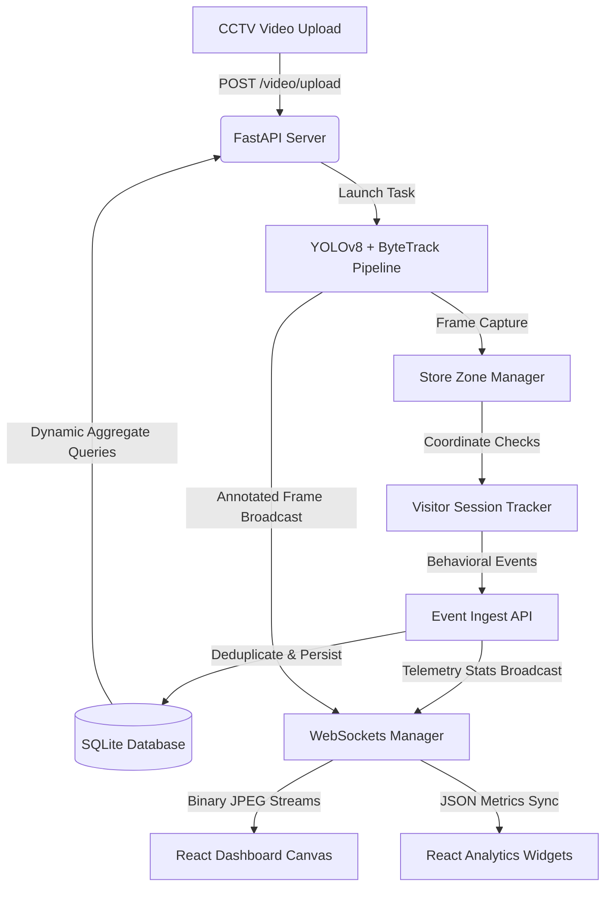

# System Architecture Design - AI Retail Intelligence Platform

This document describes the high-level system design, data pipelines, technical trade-offs, and scaling considerations implemented in the **AI Retail Intelligence Platform**.

---

## 1. System Topology Overview

The platform uses a **decoupled, event-driven, microservices-inspired architecture** structured around a unified FastAPI coordinator. 

Below is the logical data flow representing how raw security video transforms into live analytics visualizations on the React dashboard:

---

## 2. Detection & Tracking Pipeline Topology

The core processing pipeline in `/pipeline/` coordinates deep learning object detection with a temporal-spatial behavioral state machine:

### A. YOLOv8 & ByteTrack Core (`pipeline/detect.py`)
- **YOLOv8 Object Detection**: Bounding boxes are filtered by confidence ($\ge 0.25$) and class `0` (person) to ensure high counting accuracy and eliminate non-shopper detections.
- **ByteTrack Tracking**: Binds localized bounding boxes across consecutive frames using spatial overlap (Intersection over Union - IoU) and box motion forecasting, assigning stable tracking IDs.

### B. Custom Tracking & Session Orchestration (`pipeline/tracker.py`)
- Coordinates entry/exit line crossings using a Supervision line trigger.
- Monitors spatial coordinates against dynamically scaled multi-polygon zone boundaries (`SKINCARE`, `COSMETICS`, `BILLING_QUEUE`, `STAFF_ONLY`).
- Feeds each visitor ID into a custom state machine:
  - **ENTRY**: Initial tracking detection or crossing of entry line.
  - **ZONE_ENTER / ZONE_EXIT / ZONE_DWELL**: Tracks exact entry time, calculating dwell time in milliseconds upon exit.
  - **BILLING_QUEUE_JOIN / BILLING_QUEUE_ABANDON**: Shopper enters the cashier queue, and either dwells to check out or abandons the queue (exiting back into retail zones).
  - **EXIT**: Crosses the line out or is implicitly timed out at borders.
  - **PURCHASE**: Flagged if a customer dwells in the billing queue for $\ge 2.5$ seconds and exits directly from the store, signaling checkout completion.

---

## 3. Real-Time Telemetry & Streaming Strategy

To provide a zero-latency, lag-free live monitoring experience, the platform implements a **producer-consumer WebSockets broadcast pacing model**:

1. **Frame Down-Scaling & Quality Compression**: Frames are resized to `960x540` and JPEG-compressed at `80%` quality, reducing raw frame sizes by $\approx 85\%$.
2. **Dynamic Streaming Rate Limiter**: Processed frames are throttled to a paced `~12.5 FPS` (every 2 frames from a 25 FPS video). This ensures visual fluidity on the dashboard while preventing TCP network buffering bottlenecks.
3. **Pushed Analytics State**: Video overlays and live aggregate numbers (conversion rate, occupants, queue wait times) are packed together inside a single JSON frame stream payload, ensuring visual overlays are perfectly synchronized with the dashboard KPI cards.

---

## 4. Production Engineering & Resiliency

### A. Partial Ingest & Database Resiliency (503 Handlers)
To maximize hackathon stability and represent true production engineering quality, the backend implements custom middleware to intercept SQLAlchemy database connectivity drops. 
If the SQLite file is locked or disconnected:
- Intercepts raw exceptions, logging a structured trace ID.
- Returns a standardized HTTP `503 Service Unavailable` JSON response instead of exposing internal Python tracebacks.
- The pipeline `EventEmitter` catches failures, buffering events locally in an offline cache, and retries when database locks release (graceful degradation).

### B. Staff Exclusions
- Store employees are completely excluded from customer counts, funnel metrics, and conversion percentages.
- Exclusions are done behaviorally: tracking IDs that occupy the store for high percentages of the clip (greater than 120 seconds) or dwell behind the cashier register (`STAFF_ONLY` zone) for more than 15% of their total tracking history are permanently flagged as staff in the database.
